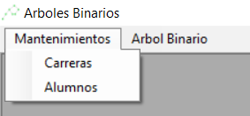
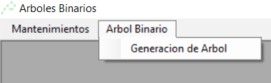
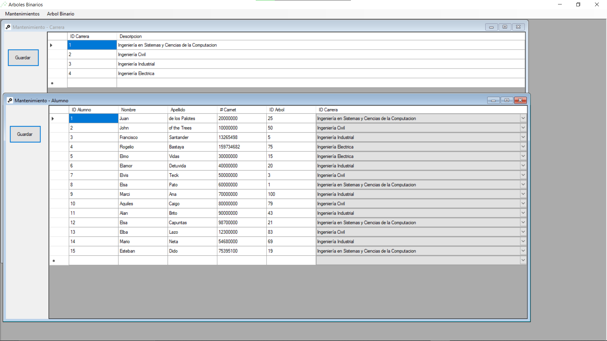
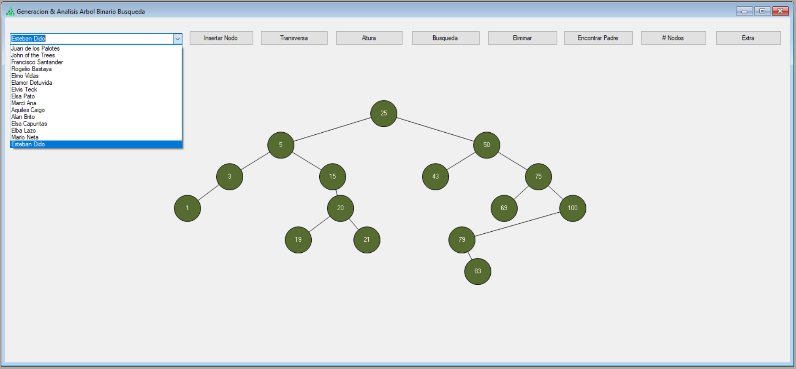
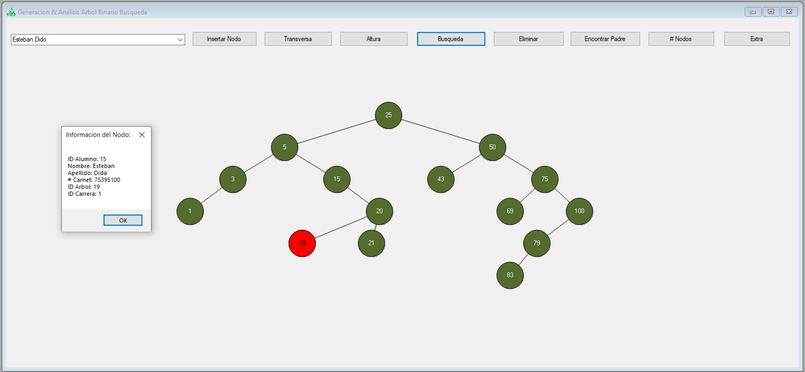
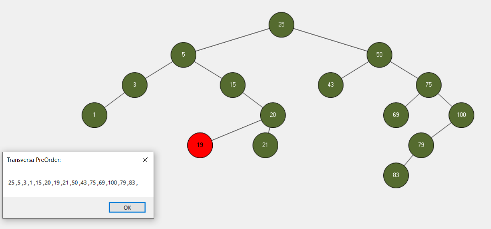
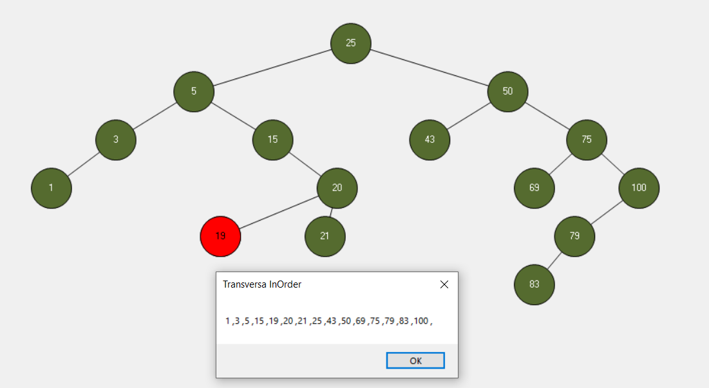
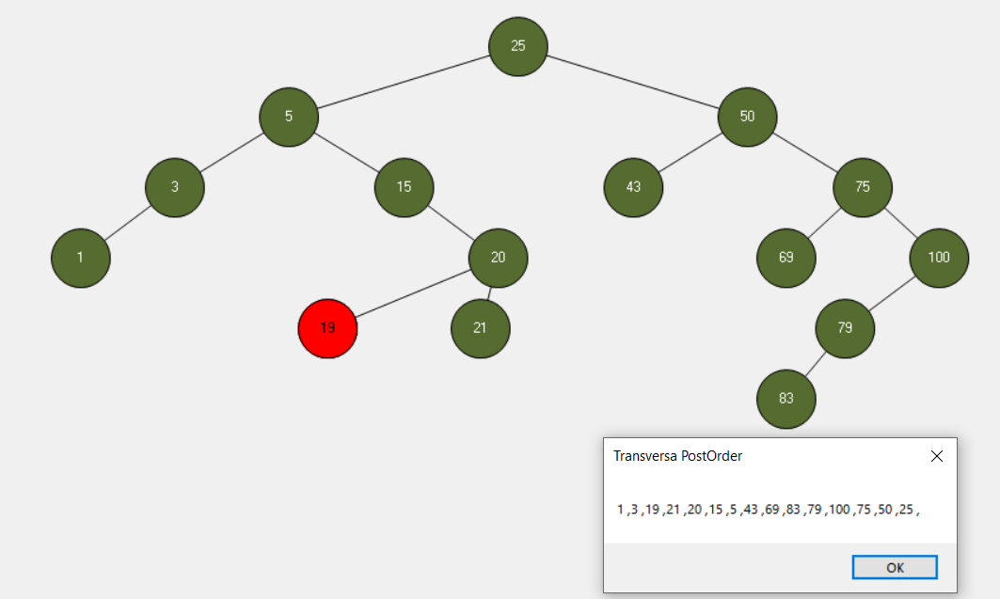
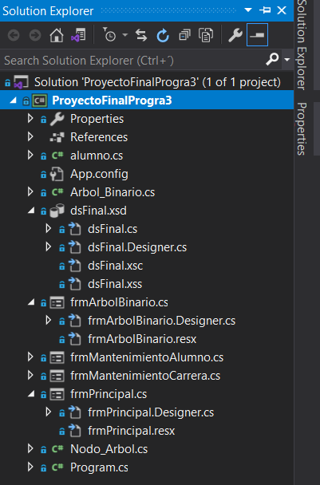

# Arboles Binarios C Sharp

Proyecto final para el curso de programación 3. Arboles de búsqueda binarios con access.

## Arbol Binario de Busqueda

## Mantenimientos

Mantenimientos de las tablas access.

## Arbol Binario de Busqueda

- Operaciones Básicas: Ingreso, Edicion y Eliminacion de Datos ✅
- Numero de Nodos, Altura de Arbol, Transversa y Recorridos, Dibujo de Arbol, Busqueda de Nodo, etc. ✅
- A la hora de hacer click en un nodo se presenta la informacion del alumno ✅

### Clases incluidas en el proyecto

Gracias por su atencion :)
